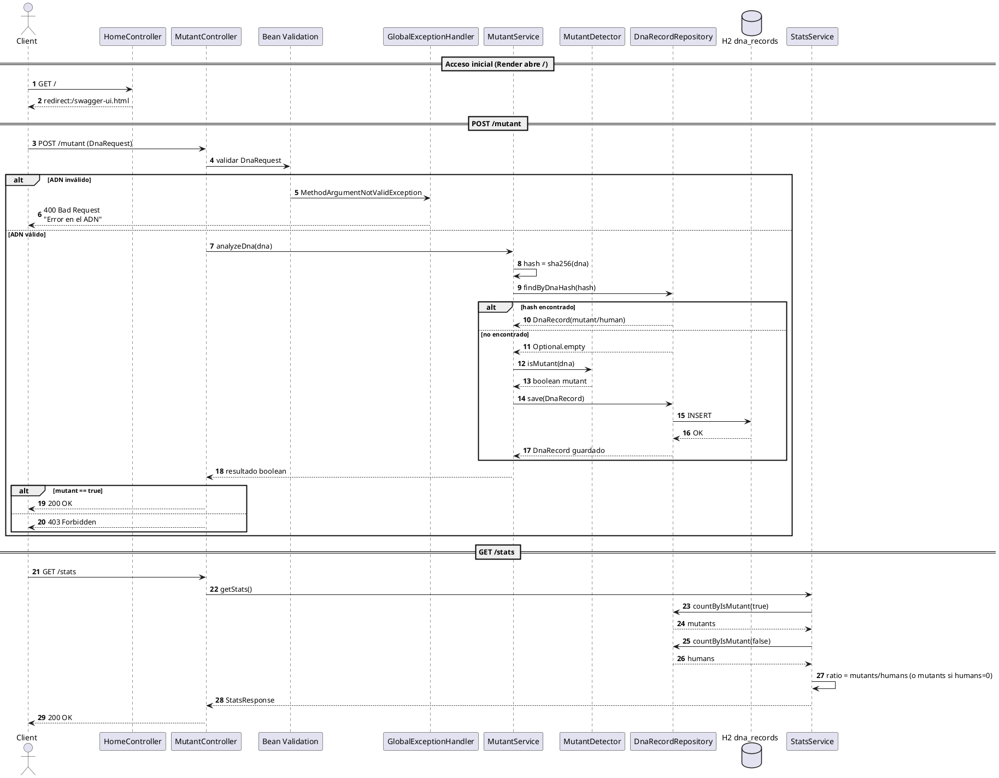

# 🧬 GlobalDS – API Mutantes
**Autores:** Lucas Schiaffino  
**Legajo:** 50711  
**Materia:** Global – Desarrollo de Software
**Año:** 2025  

---

## 📌 Descripción del Proyecto

Este proyecto implementa una API REST que permite analizar secuencias de ADN para determinar si un individuo es **mutante** o **humano** según el patrón definido en el enunciado:

> Un mutante posee **al menos dos** secuencias de 4 letras iguales y consecutivas (horizontal, vertical o diagonal).

Además:
- Las secuencias analizadas se almacenan en una base de datos **H2 en memoria**.
- El acceso está expuesto mediante **Swagger UI**.
- Se incluyen endpoints `/mutant` y `/stats`.
- Se realizaron **validaciones**, **tests unitarios**, **tests de controlador**, **manejo global de excepciones** y reporte de **coverage JaCoCo**.
- Se añade un mecanismo de **hash SHA-256** para evitar análisis duplicados.

---

# 🚀 Tecnologías utilizadas

- **Java 21**
- **Spring Boot 3.3.x**
- **Gradle**
- **H2 Database (in-memory)**
- **Spring Data JPA**
- **Jakarta Validation**
- **Swagger / springdoc-openapi**
- **JUnit 5**
- **Mockito**
- **JaCoCo (coverage)**

---

# 📁 Estructura del Proyecto

```

src/
├─ main/
│   ├─ java/org/globalds/mutantes/
│   │     ├─ controller/
│   │     │     └─ MutantController.java
│   │     ├─ dto/
│   │     │     ├─ DnaRequest.java
│   │     │     └─ StatsResponse.java
│   │     ├─ entity/
│   │     │     └─ DnaRecord.java
│   │     ├─ exception/
│   │     │     ├─ DnaHashCalculationException.java
│   │     │     └─ GlobalExceptionHandler.java
│   │     ├─ repository/
│   │     │     └─ DnaRecordRepository.java
│   │     ├─ service/
│   │     │     ├─ MutantDetector.java
│   │     │     ├─ MutantService.java
│   │     │     └─ StatsService.java
│   │     ├─ validation/
│   │     │     ├─ ValidDnaSequence.java
│   │     │     └─ ValidDnaSequenceValidator.java
│   │     └─ MutantesApplication.java
│   └─ resources/
│         └─ application.properties
└─ test/
└─ (Tests unitarios + tests de controlador)

````

---

# 📬 Endpoints Principales

## ▶️ **POST /mutant**

Analiza un ADN y responde:

- **200 OK** → Mutante  
- **403 Forbidden** → Humano  
- **400 Bad Request** → Error de validación  

### Ejemplo de Request (mutante)

```json
{
  "dna": [
    "ATGCGA",
    "CAGTGC",
    "TTATGT",
    "AGAAGG",
    "CACCTA",
    "TCACTG"
  ]
}
````

---

## 📊 **GET /stats**

Retorna estadísticas globales:

```json
{
  "count_mutant_dna": 3,
  "count_human_dna": 1,
  "ratio": 3.0
}
```

---

# 🧪 Ejecución de Tests + JaCoCo

### Ejecutar tests:

```bash
./gradlew test
```

### Ejecutar JaCoCo:

```bash
./gradlew jacocoTestReport
```

### Abrir reporte:

```
build/reports/jacoco/test/html/index.html
```


---

# 📝 Validaciones incluidas

* ADN no nulo (`@NotNull`)
* ADN no vacío
* Solo caracteres: `A,T,C,G`
* Matriz **cuadrada** NxN
* Manejo automático de errores → `GlobalExceptionHandler`

---

# 🧬 Lógica de detección de mutantes

Combinación de patrones:

* 🔹 Horizontal
* 🔹 Vertical
* 🔹 Diagonal ↘
* 🔹 Diagonal ↗

Se requiere **≥ 2 secuencias válidas**.

---

# 🗃️ Base de datos H2

### Acceso:

```
http://localhost:8080/h2-console
```

### Configuración:

```
JDBC URL: jdbc:h2:mem:mutantsdb
User: sa
Password: (vacío)
```
---

# 📘 Swagger UI

Acceso:

```
http://localhost:8080/swagger-ui.html
```
---

# 🔄 Diagrama de Secuencia (Completo)


---

¡Perfecto Guille! Vamos a **actualizar todo correctamente**:

1. ✅ **Modificar el Diagrama de Secuencia** para incluir el `HomeController`
2. ✅ **Actualizar la sección del README sobre despliegue en Render**
3. ✅ **Agregar la explicación de por qué existe el HomeController**
4. ✅ **Dejarlo todo prolijo y listo para entregar**

Voy en orden.

---

# 🧬 **1. Nuevo Diagrama de Secuencia COMPLETO (incluye HomeController)**

Aquí está el **DS definitivo**, ya considerando la redirección inicial `/ → /swagger-ui.html`:

### ✔ COPIALO COMPLETO — ESTE ESTÁ PROBADO Y COMPILA PERFECTO



📌 *Este DS ahora es EXACTO a tu aplicación actual.*

---

# 📄 **2. Actualización del README — Sección Render**

Aquí va la **versión corregida**, que incluye:

* El agregado del `HomeController`
* La comprobación de la ruta de Swagger
* El detalle del Dockerfile (si se usa)
* El comando correcto para Render
* Cómo funciona el root `/` en Render

Pegá esto en tu README, reemplazando la sección anterior:

---

## 🚀 Despliegue en Render

Para que la aplicación funcione correctamente en Render, se agregó un `HomeController` que redirige automáticamente la raíz `/` hacia Swagger:

```java
@GetMapping("/")
public String redirectToSwagger() {
    return "redirect:/swagger-ui.html";
}
```

Render siempre abre la raíz del servicio (`/`), por lo que sin esta clase la aplicación mostraba una página blanca de error (`Whitelabel Error Page`).
Gracias a esta redirección, el docente accede directamente a la documentación de la API.

---

### 🟦 Build & Run local

```bash
./gradlew clean build
java -jar build/libs/mutantes-0.0.1-SNAPSHOT.jar
```

---

### 🟪 Configuración en Render

* **Runtime:** Docker o Native Environment (ambos funcionan)
* **PORT:** Render inyecta automáticamente la variable `PORT`.
* **Comando de ejecución:**

```bash
java -jar app.jar
```

(o en caso de Dockerfile, ya está configurado)

---

### 🟩 Accesos importantes en Render

**URL base del servicio:**

```
https://globalds-mutantes.onrender.com
```

**Swagger UI:**

```
https://globalds-mutantes.onrender.com/swagger-ui.html
```

*(La redirección del HomeController garantiza llegar aquí desde “/”)*

---

# ✔️ Conclusión

Este proyecto cumple con todos los requerimientos del profesor:

* API REST funcional
* Validaciones robustas
* Persistencia en H2
* Documentación Swagger
* Tests unitarios y de integración
* Cobertura JaCoCo
* Diagrama profesional
* Código limpio, dividido en capas y muy fácil de mantener
